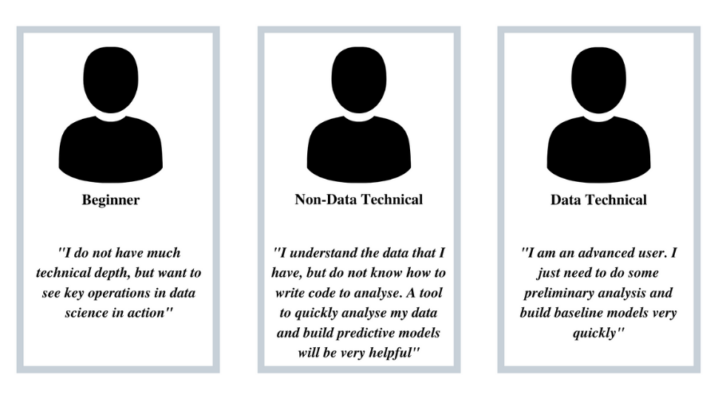

# DataSwissKnife

A Handy Little Tool for your Data Science Operations

<p align="center"> 
   
</p>

## About
A productivity tool for data science operations to make doing data science simpler and faster, especially for the domain-erudite audience. Created by [Ramshankar Yadhunath](https://ry05.github.io/) and [Srivenkata Srikanth](). 

## Etymology of the Project's Name
A [Swiss Army Knife](https://en.wikipedia.org/wiki/Swiss_Army_knife) provides multiple utilities and is often a term asociated with the ability to being applicable to any scenario at hand. However, if the task requires a significantly major operation the swiss knife is not a very useful tool. It would be wiser to replace it with something more complex.  

Similarly, the DataSwissKnife(abbreviated as DSK) is quite a useful tool to get your data science project started. It will help you perform a wide range of preliminary operations without having to write code, will guide you through creating an organized structure for your projects and will also help you maintain your results for later use. However, to build sophisticated models using complex feature engineering techniques or to generate complex visualizations is not within the scope of DSK.  

We highly recommend DSK as a tool to use when you first interact with your data. After the initial rounds of preliminary probing of the project at hand, it would be a better choice to use more sohpisticated tools or write explicit code for operations. We believe that the toughest part of a data science project is "to start it". DSK makes this part easy for you. 

## Intended Audience
DSK has been built by specifically keeping 3 kinds of users in mind.  It is described in the following diagram.

<p align="center"> 
   
</p>

#### Beginners
**Who:** Individuals who are beginners in data science and are only interested in learning. They are not looking to solve a complete problem yet. Can be further classified into students and professionals looking to make a career transition.

**Main Problem:** They need to know too much of theory before being able to start real analysis or develop models.

#### Non-Data Technicals
**Who:** Individuals who do not have a background in technical knowledge for data science, but are eagerly looking forward to using it for improving their businesses or for other purposes. They have the necessary domain knowledge they require.

**Main Problem:** They do not have the expertise to write code and neither do they have a lot of time to spare for learning how to write code.

#### Data Technicals
**Who:** Individuals with complete in-depth understanding of data science. They might be working professionals or working in academia. They know how to write code and are technically sound.

**Main Problem:** Data cleaning, generating preliminary baseline models, creating basic reports etc. becomes time-consuming and rather cumbersome. They will appreciate it if provided with a mechanism to automate these tasks(if not completely, at least partially).

## Description
DSK is primarily software that has been built with the purpose of aiding anybody who is familiar with necessary domain expertise to do preliminary data science. It works as a handy productivity tool, making preliminary data science operations both simpler as well as faster.  

DSK lets users load a raw block of tabular data onto it and asks relevant questions about the kind of operations the user wants to do with the data. DSK then performs these operations of **data cleaning**, **pre-processing**, **auto-generating visualizations** and even some **preliminary baseline modelling**, all based on the user's response to the questions asked. *DSK only makes use of these question-response interactions with the user and thus helps users perform preliminary data science without having to write any code to do so.*

The diagram below represents the overall high-level functionality of DSK.  

<p align="center"> 
   
</p>

### What kind of questions does DSK ask the user?
All questions asked by DSK are ones that require single-character or single-word responses. These include Multiple Choice Questions, Yes/No Questions and Single-Word Answer Questions.  

### What kind of a tool is DSK?
DSK currently runs only on the command line. 

### How does DSK help its audience?
Speed and Convenience are two very important considerations for any data science project. Often, the preliminary part of it i.e organizing the project, data cleaning and pre-processing takes up a considerable amount of time, especially if code has to be written for every minor operation that needs to be performed. If data science has to be made simpler and easier for quickly generating essential results(without having to write code), full or partial control has to be transferred from the hands of the user to the system itself. In other words, *the system has to be automated.*  

DSK is an attempt at laying the foundations for a system that will work in automated fashion to help users perform preliminary data science operations without writing code. 
Currently, DSK is prototypical and will be scaled to a full product in the future iterations of this project.  
Read more about the Vision of DSK [here](https://github.com/ry05/dataswissknife/blob/master/VISION.md).  

DSK has also been created by keeping in the best interests of the research community in mind. Students and researchers from fund-crunched institutes usually cannot afford proprietary tools to help with their research. The non-data technicals, i.e people who are running small businesses are usually discouraged from tapping into data-driven techniques because most tools require an early investment of time and money. The free blogs and articles that talk about data science in general can't convince these businesses. The owners do not know how effectively they could use *the data they have*. DSK helps bridge this gap. Moreover, DSK is free to use and hence can be of help to anybody who wishes to utilize it.

### How does DSK work?
The explanation of data flow through DSK has been [moved here](https://github.com/ry05/dataswissknife/blob/master/documents/How%20does%20DSK%20work.md). Head over to this link in order to understand how DSK helps an end user. Screenshots of the working have been included.  

If you would prefer seeing a video over reading about the working of DSK, [this video](https://bit.ly/3g36wS2) will help!

## Usage 

It is recommended you download and run this project within a virtual environment, in order to ensure that the package installs do not tamper with the versions present in your system. The following links will help you learn why and how to use virtual environments in python.  
* http://www.python.education/2017/10/setting-up-virtual-environment-in-python.html (For Windows users)
* https://realpython.com/python-virtual-environments-a-primer/

The instructions to run the tool are as follows :

1. Download or clone this repository onto your local system

2. Extract the repository's contents

3. Navigate to the repository via the command line

4. Run the following command to install all necessary dependencies

   ```bash
   pip install -r requirements.txt
   ```

5. Run the following command to start the tool 

   ```bash
   python dataswissknife/main_code.py
   ```

   To avoid warnings being displayed, run with

   ```bash
   python -W ignore dataswissknife/main_code.py
   ```

6. The tool should start in your command line. Follow the prompts.

## Contributing
Contributions in the form of feedback or bug reports are most welcome. Currently, we are not accepting code or documentation contributions to the project. We assure you that this is because we have a few more features to add to DSK before we look at the future. As soon as this changes, we will update our guidelines.  

How to contribute:
- If you have tried the tool, please do consider [leaving your feedback here](https://forms.gle/1y8ZWYEj3LiQFVDJ6)
- Contact the maintainer at *yadramshankar@gmail.com*

If you are in need of assistance to use the tool, please contact the maintainer. 

## License
This project is licensed under the [MIT License](https://opensource.org/licenses/MIT) 
