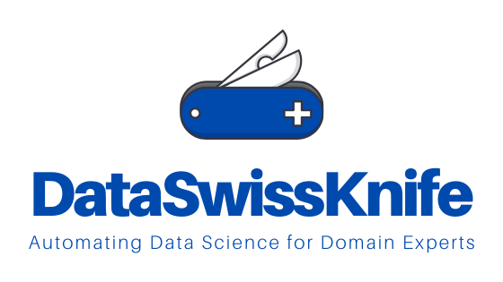
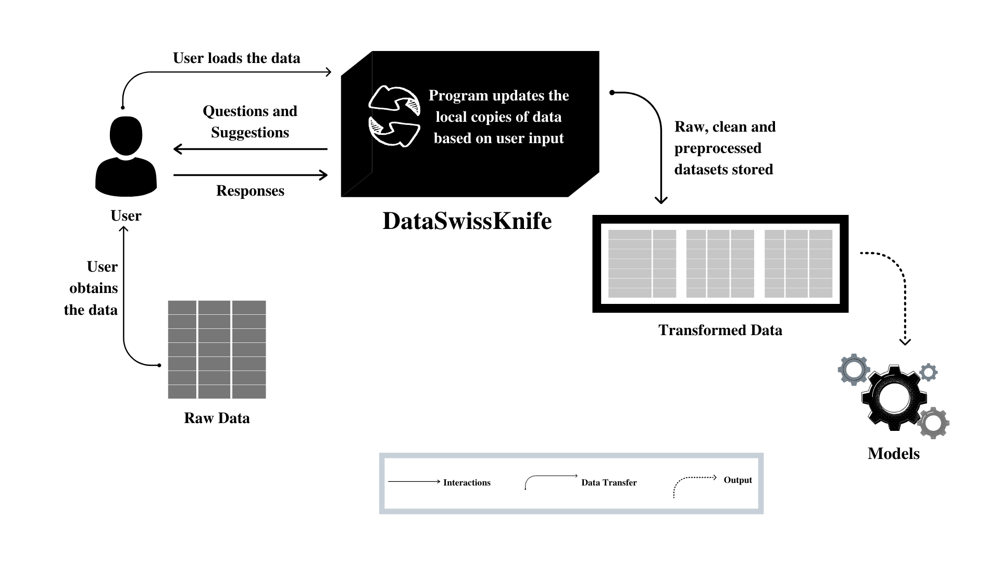
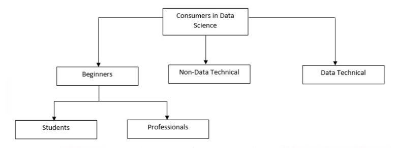

# DataSwissKnife

A Handy Little Tool for your Data Science Operations

<p align="center"> 
   
</p>


## Description
*Are you a data science beginner who wishes you had access to a tool that would help you watch data science in action **without writing code**? Or are you someone who understands the importance of data in your business, **but lack the technical grounding to code**? Or are you an expert-level researcher or data scientist who just wishes to do some preliminary analysis or build baseline models **without having to spend time writing code**?* 

If you fall into any of these categories, the DataSwissKnife project(abbreviated as DSK) will be of help to you. DSK is software that has been built with the purpose of aiding anybody who is familiar with necessary domain knowledge to do preliminary data science. The term **"domain knowledge"** signifies the relevant information a given user has with respect to the dataset he or she analysing. The kinds of information a user needs to know about their the concerned dataset include:

* What is the data about? Why is the data being analysed?
* What features does the dataset contain? What are the expected data types of these features(i.e numerical or non-numerical)?
* Does the dataset contain outliers? If yes, which features do you think would contain outliers?
* And more...

DSK lets users load a raw block of tabular data onto it and by asking relevant questions about the kind of work the user wants to do with the data; DSK performs the operations of **data cleaning**, **pre-processing**, **auto-generating visualizations** and even some **preliminary baseline modelling**. *DSK only makes use of these question-response interactions with the user and thus helps users perform preliminary data science without having to write any code to do so.*

Fig. 1 describes how DSK works. 

<p align="center"> 
   
</p>

<p align="center"> 
    Fig 1. DSK Block Diagram
</p>


### Background - Why is this important?

There is no doubt that data science is one field that has recently seen a surge in the number of people who want to work in it. From school students to experienced professionals, everybody is trying to figure a way to enter this mercurial field born out of the confluence of multiple disciplines. However, it is no secret that like all fields, getting into data science and being able to leverage data science abilities for your business is not an overnight job. It takes time to learn and apply these concepts. This time space might be further extended if individuals lack the technical expertise to readily analyse data. The problem with this extended time space is that it *delays the ability of a person to see how impactful data science can be for his or her work.* 

In fig. 2, the different consumers of data science have been broadly categorized. 

<p align="center"> 
   
</p>

<p align="center"> 
    Fig 2. Consumers of Data Science
</p>

#### Beginners

**Who:** Individuals who are beginners in data science and are only interested in learning. They are not looking to solve a complete problem yet. Can be further classified into students and professionals looking to make a career transition.

**Main Problem:** They need to know too much of theory before being able to start real analysis or develop models.

#### Non-Data Technicals
**Who:** Individuals who do not have a background in technical knowledge for data science, but are eagerly looking forward to using it for improving their businesses or for other purposes. They have the necessary domain knowledge they require.

**Main Problem:** They do not have the expertise to write code and neither do they have a lot of time to spare for learning how to write code.

#### Data Technicals

**Who:** Individuals with complete in-depth understanding of data science. They might be working professionals or working in academia. They know how to write code and are technically sound.

**Main Problem:** Data cleaning, generating preliminary baseline models, creating basic reports etc. becomes time-consuming and rather cumbersome. They will appreciate it if provided with a mechanism to automate these tasks(if not completely, at least partially).

​	

### The Idea of DSK as a Solution

The gravity of the problem statement at hand calls for a new approach to data science. If data science has to be made simpler and easier for quickly generating essential results(without having to write code), full or partial control has to be transferred from the hands of the user to the system itself. In other words, *the system has to be automated.* Therefore, DSK is an attempt at setting the foundations for a system that will work in automated fashion to help users perform preliminary data science operations without writing code. Currently, DSK is prototypical and will be scaled to a full product in the future iterations of this project.

 

## Usage 
### Instructions to run the tool

1. Download or clone this repository onto your local system

2. Extract the repository's contents

3. Navigate to the repository via the command line

4. Run the following command to install all necessary dependencies

   ```bash
   pip install -r requirements.txt
   ```

5. Run the following command to start the tool 

   ```bash
   python dataswissknife/main_code.py
   ```

   To avoid warnings being displayed, run with

   ```bash
   python -W ignore dataswissknife/main_code.py
   ```

6. The tool should start in your command line. Follow the prompts.


### Explanation of Data Flow through DSK

First, the user **obtains** raw data. This raw data is expected to be in a tabular format and if it is to be used for supervised classification, it should have both descriptors as well as the target feature. The user then **loads** this data onto the DataSwissKnife program. From here, the system-user interaction begins. The first step is for the program to ask the user to **choose a directory** in his or her local system where all the contents and results of the execution of the program will be stored. Once this has been decided, the program **creates a structure** in the user designated directory. After this, the program **starts asking questions** to the user that will be based on what the user wants to do with the data. *For example, the program can ask the user the action he or she would like to take up to deal with missing values in a given feature.*

The program also **provides suggestions** where possible. It **performs corresponding actions on the data** based on the user’s responses. After all data operations(cleaning and preprocessing), the **final outputs are stored** in the project’s directory(chosen earlier by the user) as raw data, cleaned data and preprocessed data. 

The preprocessed data is **passed onto the model** training section. The program also **generates visualizations and reports** from the data provided and also the intermediate data outputs.

- Examples of how to use
- Links to other wholesome explanations


### Dissecting DSK's Operation

The aim of this section is to dissect the *DataSwissKnife* system and provide low-level details of how each component works. 

For the sample depicted here, the train.csv file of the [Titanic dataset](https://www.kaggle.com/c/titanic/data) has been used.

#### Create Structure in the Host’s System
The first action performed is to create a hierarchical directory structure within the user’s computer system. The user can choose the location where he or she wants to place this project structure (as in fig 3). The *ROOT* name or the name of the project has to be set by the user. 

<p align="center"> 
    Fig 3. Project Structure in the Host’s System
</p>

The subdirectories are data, visualizations, models and reports. The *data* subdirectory is further divided into *raw*, *clean* and *processed.* Raw has the original copy of the dataset, clean has the cleaned copy and processed has the data that is ready to be passed into an ML model. 
*Visualizations* contain the auto-generated visualizations from data and models has the machine learning models as .pkl files. Finally, *reports* will contain basic, preliminary reports of the data and analysis performed.
The importance of this step is that it makes the results reproducible. This means that the user can access cleaned and preprocessed intermediaries of the dataset, visualizations and basic models at a later stage without having to run this whole program again. 


<p align="center"> 
    Fig 4. Choosing the location to place the project directory
</p> 


<p align="center"> 
    Fig 5. Naming the project directory; The project directory is created in the system and the path is provided
</p> 

#### Load Data
After the project structure has been made, the next step is to load the data. As of its first version, DataSwissKnife only supports .csv files. It is expected that the user already has the dataset in his local system. When this dataset is loaded onto the project through DataSwissKnife(DSK), a copy of this is stored in *root/data/raw.*


<p align="center"> 
    Fig 6. Choosing the dataset from the user's local system
</p> 


<p align="center"> 
    Fig 7. Output after loading and renaming the dataset; a preview is generated
</p> 

#### Clean Data

This block is concerned with cleaning up the data. A series of questions are asked by DSK and based on user response, the data is cleaned. DSK also performs some preliminary cleaning at the start as soon as it receives the data(without user intervention) and these automated cleaning steps are:

* Rename column names such that there are no spaces in the names and all characters are lowercase
* Remove columns that have only a single value for every instance
* Remove empty columns and rows
* Round of decimal values to 3 decimal places
* Remove duplicate rows
* Remove trailing and leading spaces for values

The other cleaning steps are dealing with missing values and consistency checkers. DSK asks questions to the user, which have one word answers. Based on user responses, cleaning is performed.


<p align="center"> 
    Fig 8. The initiation of Data Cleaning
</p> 


<p align="center"> 
    Fig 9. Missing value percentages in the data
</p> 


<p align="center"> 
    Fig 10. Missing value percentages in the data after removing features with more than 60% as missing values
</p> 

 

<p align="center"> 
    Fig 11. Performing imputation to fill in the remaining missing values
</p> 


<p align="center"> 
    Fig 12. All missing values have been dealt with
</p> 

Another step of data cleaning is to check for datatype inconsistencies. A data type inconsistency occurs when a feature is in a datatype that does not facilitate analysis that the user would like to do. An example of this is when a feature like money is encoded as a non-numeric type(i.e object in pandas) because of entries like “50\$”. In such a case, DSK’s datatype inconsistency dealer module will first identify these inconsistencies based on the user’s responses to how he or she would prefer a feature to be (numeric or non-numeric) and checks these against the actual types with which these features have been encoded. After identifying inconsistent features, DSK flags off non-numeric characters. In our example of money, “​\$” is a non-numeric character. DSK flags this off and provides the user with an opportunity to remove these values from the data. After removing “$” symbols, we can see that our money feature can now be converted into numeric type easily. If there are no inconsistencies, then that too is informed to the user (fig 13).


<p align="center"> 
    Fig 13. Datatype consistency management
</p> 

After this step, the clean data is stored in *root/data/clean*

#### Preprocess Data
Data preprocessing concerns itself with converting clean data into a format more suited for machine learning modelling. So far, the data has only been a single .csv file with both descriptors and target features together. In preprocessing, a series of steps are performed that convert this single .csv file into train.csv, test.csv(has test data descriptor values) and test_solution.csv(has test data target values). *80% of the original data is maintained as the train set and 20% is maintained as the test set.*

Initially, these 3 files are stored in *root/data/clean*. But after all preprocessing steps, the preprocessed versions of these 3 files are stored in *root/data/processed*. 


<p align="center"> 
    Fig 14. Prompts to enter the target
</p> 

Steps performed are

* Automatically detect identifier features(unique for every instance in the dataset) and remove them
* Detect features with more than 70% values as unique and ask the user if he or she wants to keep these values or remove them
* Interact with the user to identify the specific data type for each given feature. 
  * Asks if feature is **ordinal**
    * If response is no
      * If feature is numerical, the feature is of **ratio** type
      * If feature is non-numerical, asks if feature is **interval** type
        * If response is no, feature is **nominal**
        * Else, feature is **interval**
    * Else, feature is **ordinal**


<p align="center"> 
    Fig 15. Interact with the user to choose feature types
</p> 

Interact with user to identify the features from which the user will like to remove outliersNormalize features as per user’s requirement. Currently, only one-hot encoding is performed for nominal features. Label encoding will be performed only for ordinal features(if any)


<p align="center"> 
    Fig 16. Other preprocessing steps with the help of user input
</p> 

#### Visualize Data

DSK auto-generates visualizations based on the data it has. Currently, only density plots, box plots and count/frequency plots are generated.


<p align="center"> 
    Fig 17. Data visualization
</p> 


<p align="center"> 
    Fig 18. Auto-generated plots
</p> 

#### Model Data
DSK performs supervised classification. It takes the pre-processed datasets and builds baseline models and evaluates the models using a 10-fold stratified cross validation strategy. The baseline models are built on the following algorithms

* Logistic regression
* Decision Trees
* Random Forests
* K Nearest Neighbours
* Support Vector Machines 

DSK first fits and evaluates on the train.csv file. After it produces the results for the same, the user is provided an option to choose which model he or she would like to store and use on the test.csv file. Based on the user’s choice, a particular model estimator is saved in *root/models*.


<p align="center"> 
    Fig 19. Baseline model results
</p> 

The **Report results** block will be implemented as a part of this project’s future work.

We encourage you to try this out with other datasets and see DSK in action for yourself!


## Caveat 

While DSK will help with some very basic operations, we do not make a claim that DSK can replace traditional ways of learning and using data science i.e by writing code. Therefore, if you are a data science aspirant, we strongly urge you to continue learning your concepts and use DSK as a tool to help you generate some quick results.


## Support
DSK is a project that our team has worked on as a part of our final year project in our CSE undergraduate degree. Since we are making an attempt to deal with making data science more accessible and easy for everyone, we would strongly encourage the community's support in making DSK better and more user friendly with every future version.

In case of queries, suggestions or concerns, please feel free to reach me at *yadramshankar@gmail.com*


## License
This project is licensed under the [MIT License](https://opensource.org/licenses/MIT) 
